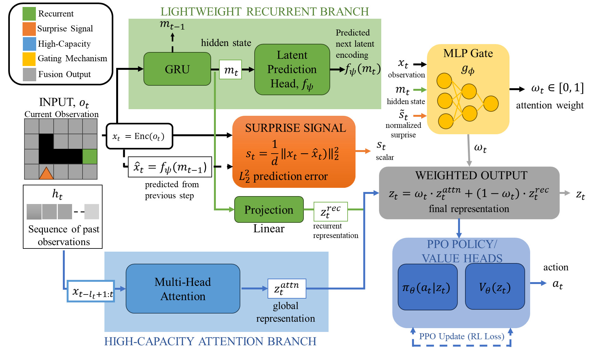
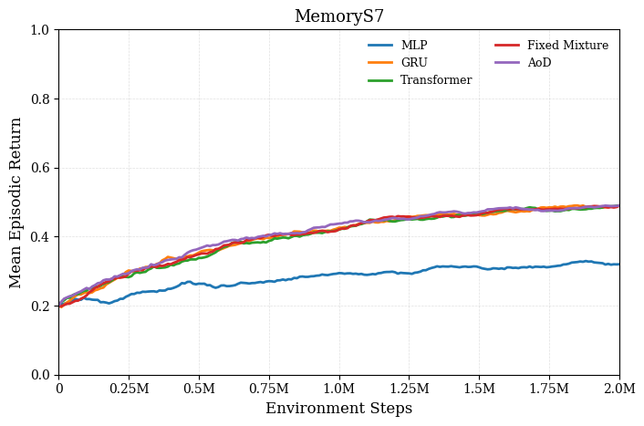
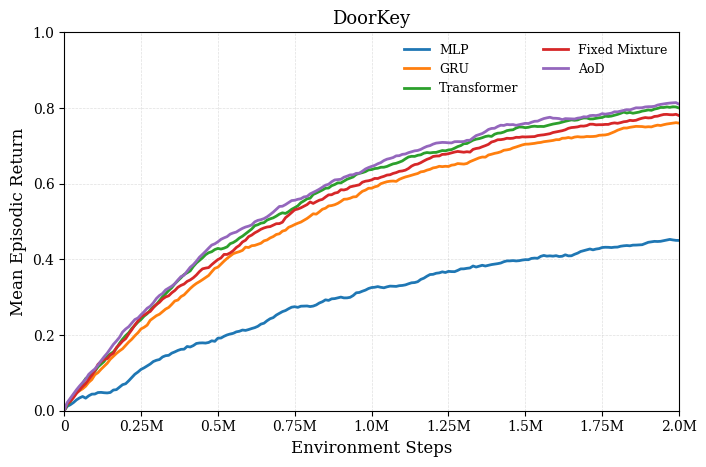
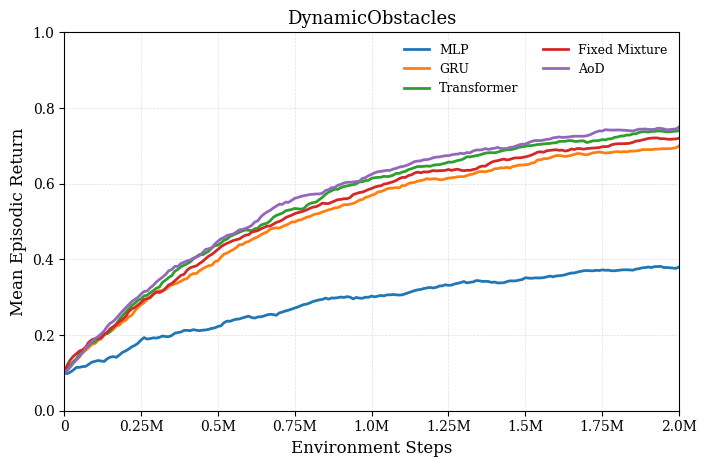
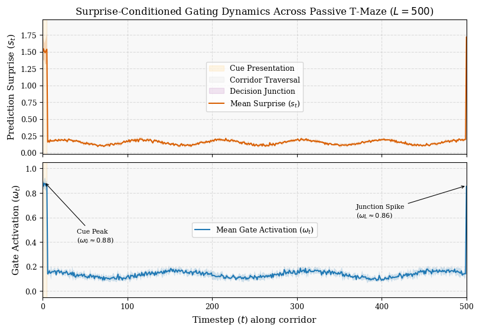

# Attention-on-Demand (AoD)

## Surprise-Conditioned Attention Reliance in Reinforcement Learning




## Repository layout

The following filenames follow the current project description; confirm their paths against the released repository:

```text
train.py             Training entry point
models.py            Policy architectures
ppo.py               PPO optimization and auxiliary losses
env_utils.py         Environment creation and wrappers
logger.py            Run logging
analyze.py           Analysis and plotting
run_experiments.sh   Experiment sweep
requirements.txt     Python dependencies
```

## Install

From the repository root:

```bash
pip install -r requirements.txt
```

Check the versions pinned in `requirements.txt` before running the scripts. In particular, the vector-environment autoreset and final-observation behavior must match the trainer's truncation-handling code. If using Gymnasium 1.x, confirm the installed version and the trainer agree on the autoreset mode and final-observation key.

If the trainer requires Gymnasium 1.3.0's vector autoreset and final-observation
API, install the matching version with `pip install "gymnasium==1.3.0"` and
verify the final-observation key handled in `ppo.py`.

Optional environment families:

```bash
pip install minigrid
pip install popgym
```

The policy has a categorical action head. Check the action space of each
POPGym environment before training; continuous-action tasks need a different
head or an explicitly implemented wrapper. Examples to check include
`popgym-RepeatPreviousEasy-v0`, `popgym-RepeatPreviousMedium-v0`,
`popgym-CountRecallEasy-v0`, and `popgym-AutoencodeEasy-v0`. The paper additionally
reports `ConcentrationEasy` and `BattleshipEasy`; confirm that the released
code supports their action spaces and wrappers.

## Paper experiment settings

| Setting | MiniGrid paper configuration |
| --- | --- |
| Models | MLP, GRU, Transformer, Fixed Mixture, AoD |
| Environments | MemoryS7, DoorKey, DynamicObstacles |
| Independent training seeds | 5 |
| Environment steps per run | 2,000,000 |
| Parallel environments | 8 |
| Rollout length | 128 |
| PPO epochs per update | 4 |
| Minibatch size | 256 |
| Learning rate | `3e-4` |
| Hidden dimension | 128 |
| Attention heads | 4 |
| MiniGrid attention context length | 16 |
| AoD prediction-loss weight | `alpha_pred = 0.1` |
| Default AoD attention penalty | `lambda_compute = 0.01` |

The attention-penalty sweep uses `lambda_compute` values `0.001`, `0.005`, `0.01`, `0.05`, and `0.1`. The MemoryS7 observation-masking analysis uses masking probabilities `0`, `0.1`, `0.3`, and `0.5`. The Passive T-Maze and POPGym evaluations use their own context lengths as specified below.

## Quick Start

### Paper settings (MemoryS7 example)

```bash
python train.py --model mlp --env MemoryS7 --seed 0 --total_steps 2000000 --n_envs 8 --n_steps 128 --lr 3e-4 --seq_len 16
python train.py --model gru --env MemoryS7 --seed 0 --total_steps 2000000 --n_envs 8 --n_steps 128 --lr 3e-4 --seq_len 16
python train.py --odel transformer --env MemoryS7 --seed 0 --total_steps 2000000 --n_envs 8 --n_steps 128 --lr 3e-4 --seq_len 16
python train.py --model fixed_mixture --env MemoryS7 --seed 0 --total_steps 2000000 --n_envs 8 --n_steps 128 --lr 3e-4 --seq_len 16
python train.py --model aod --env MemoryS7 --seed 0 --total_steps 2000000 --n_envs 8 --n_steps 128 --lr 3e-4 --seq_len 16
```

### Additional working settings (MemoryS9 example)

These are separate from the settings used for the reported MemoryS7 table.

```bash
python train.py --model aod --env MemoryS9 --seed 0 \
    --total_steps 2000000 --n_envs 64 --n_steps 512 --env_batch_size 16 \
    --lr 7e-4 --anneal_lr --ent_coef 0.05
```

To run another model, change `--model aod` to `mlp`, `gru`, `transformer`, or `fixed_mixture`. To run another MiniGrid task, change `--env MemoryS7` to `DoorKey`, `DynamicObstacles`, or another environment registered in `env_utils.py`. Change `--seed` for each run; use the same seed identities across models for paired comparisons.

The same entry point also supports the locally registered T-Maze and POPGym tasks. For these, change `--env` to the registered task name and set `--seq_len` to the experiment's attention context. The paper uses `L + 5` for T-Maze corridor length `L` and `64` for POPGym. Check the action-space wrapper before running a POPGym task.

### T-Maze and POPGym examples

```bash
python train.py --model aod --env TMaze10 --seed 0 \
    --total_steps 1000000 --n_envs 64 --n_steps 128 --env_batch_size 16 \
    --lr 7e-4 --anneal_lr --ent_coef 0.05

python train.py --model aod --env popgym-RepeatPreviousEasy-v0 --seed 0 \
    --total_steps 2000000 --n_envs 64 --n_steps 128 --env_batch_size 16 \
    --lr 7e-4 --anneal_lr --ent_coef 0.05
```

Repeat each reported model and environment with five matching seed identities. Run the configured sweep and analysis scripts with:

```bash
bash run_experiments.sh
python analyze.py
```
<p align="center">
  
  
  
</p>
## Models and environments

| Model option | Description |
| --- | --- |
| `mlp` | Memoryless baseline |
| `gru` | Recurrent baseline |
| `transformer` | Full-attention baseline |
| `fixed_mixture` | Recurrent and attention representations mixed at a fixed weight of 0.5 |
| `aod` | Surprise-conditioned recurrent and attention mixture |

MiniGrid MemoryS7 is a **memory task**. The agent observes an object near the start and must remember it at a later junction; the 7×7 agent-view observation does not make the underlying state fully observable. DoorKey and DynamicObstacles provide the other environments in the primary MiniGrid comparison.

The extended experiments are specified in the following sections.

### Passive T-Maze

The manuscript reports five-seed results for GRU, Transformer, and AoD on corridor lengths `L = 20, 50, 100, 250, 500`. At the start of an episode, the agent observes which of two goal locations is correct; after traversing the corridor, it must select the corresponding turn. The attention context length is `L + 5` for both Transformer and AoD; the GRU carries its recurrent state across the episode. For the reported task and reward definition, chance return is `0.50` and maximum return is `1.00`.

| Corridor length | Attention context | GRU return | Transformer return | AoD return |
| ---: | ---: | ---: | ---: | ---: |
| 20 | 25 | 0.98 ± 0.02 | 0.99 ± 0.01 | 0.98 ± 0.02 |
| 50 | 55 | 0.88 ± 0.05 | 0.98 ± 0.02 | 0.96 ± 0.03 |
| 100 | 105 | 0.68 ± 0.08 | 0.96 ± 0.03 | 0.93 ± 0.04 |
| 250 | 255 | 0.53 ± 0.06 | 0.94 ± 0.04 | 0.90 ± 0.05 |
| 500 | 505 | 0.51 ± 0.04 | 0.92 ± 0.05 | 0.88 ± 0.05 |

Example for a locally registered 20-step T-Maze:

```bash
python train.py --model aod --env TMaze20 --seed 0 --seq_len 25
```

Use the other environment names actually registered in `env_utils.py` for the longer corridors; do not substitute `TMaze20` for `L = 50, 100, 250, 500`. Also confirm that the local T-Maze reward and termination rules match the manuscript's chance and maximum returns. The paper's gate-at-cue and gate-at-junction observations require time-indexed evaluation logs and cannot be regenerated from aggregate returns alone.
### Passive T-Maze: Surprise and Gate Dynamics



Prediction surprise (top) and attention gate activation (bottom) across the 500-step Passive T-Maze horizon. Curves show means across five independently trained seeds, using one evaluation episode per seed; shaded bands indicate sample standard deviation across seeds. Attention weighting is higher at cue presentation and the decision junction and lower during corridor traversal. The initial peak may also reflect recurrent-state initialization. These trajectories illustrate an association between surprise and attention weighting; both branches execute at every timestep.


### Performance Across Random Seeds

Performance across five random seeds for GRU, Transformer, and the proposed Attention-on-Demand (AoD) model. Results report evaluation return for each seed together with the mean and sample standard deviation across seeds.

| **Seed ID** | **GRU Return** | **Transformer Return** | **AoD Return (Ours)** |
|-------------|---------------:|-----------------------:|----------------------:|
| **42**      | 0.46 | 0.86 | 0.81 |
| **100**     | 0.48 | 0.89 | 0.85 |
| **1337**    | 0.51 | 0.92 | 0.89 |
| **2026**    | 0.54 | 0.95 | 0.91 |
| **8888**    | 0.56 | 0.98 | 0.94 |
| **Mean ± sample SD** | **0.51 ± 0.04** | **0.92 ± 0.05** | **0.88 ± 0.05** |

Across five random seeds, AoD achieves a mean return of **0.88 ± 0.05**, substantially exceeding the GRU baseline (**0.51 ± 0.04**) while approaching Transformer performance (**0.92 ± 0.05**). The consistent behavior across seeds indicates that AoD's performance advantage over the recurrent baseline is not attributable to a single favorable initialization.


### POPGym

The manuscript reports five-seed evaluations on four POPGym tasks using a causal attention context of 64. Returns are rescaled separately for each task by

```text
R_norm = (R - R_min) / (R_max - R_min)
```

Here `R_min` is the task's mean random-policy return and `R_max` is its theoretical maximum. These anchors need to be recorded per environment for exact reproduction; this transformation does not automatically clip every possible return to `[0, 1]`.

| Task | GRU | Transformer | AoD | AoD mean gate |
| --- | ---: | ---: | ---: | ---: |
| RepeatPreviousEasy | 0.84 ± 0.03 | 0.79 ± 0.04 | 0.83 ± 0.03 | 0.328 ± 0.024 |
| AutoencodeEasy | 0.78 ± 0.04 | 0.72 ± 0.05 | 0.77 ± 0.04 | 0.364 ± 0.021 |
| ConcentrationEasy | 0.46 ± 0.06 | 0.74 ± 0.04 | 0.73 ± 0.05 | 0.782 ± 0.026 |
| BattleshipEasy | 0.52 ± 0.05 | 0.71 ± 0.04 | 0.69 ± 0.04 | 0.744 ± 0.029 |

Example for a registered discrete-action POPGym task:

```bash
python train.py --model aod --env popgym-RepeatPreviousEasy-v0 \
    --seed 0 --seq_len 64
```

For all four tasks, check the environment ID, action and observation spaces, encoder, and any action-space wrapper in `env_utils.py`. A categorical policy head requires a discrete action or an explicitly documented mapping to one. Use the same task configuration and five seed identities across the three models. The displayed gate statistics are evaluation means aggregated across seeds, not measured compute savings.

Observation masking replaces the chosen observation input with zeros independently at a timestep with the specified probability. Confirm in `env_utils.py` whether masking is applied to image observations before encoding or to encoded vectors, and record that choice when reproducing results.

## Under Review ICLR 2027
